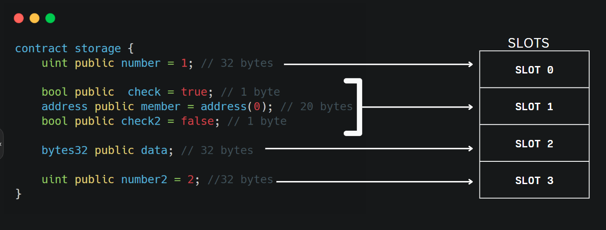

# Smart Contract Security - Accessing Private Data

According to [Solidity docs](https://docs.soliditylang.org/en/v0.8.17/contracts.html#state-variable-visibility), there are three visibility modifiers for state variables: `public`, `internal`, `private`. **Private** visibility means that **the variable can not be accessed from outside smart contracts**, and not that **the variable can not be read**. Having in mind the second common interpretation may result in crucial attacks.

### The Attack

State variables that have the `private` modifier can still be read from outside the Blockchain. To understand how, we need first to know the **Storage Layout in Solidity**.

The `EVM`(Ethereum Virtual Machine) stores variables in an array with a length of `2^256` bits in each entry, named `slots`. The EVM stores the state variables **in the order they were declared**. If two or more variables fit into a single `32-bytes slot`, the EVM packed them into the same slot, beginning on the right.



A [contract](./access-private-data-attack.sol) is written to demonstrate an example.
```
NOTE: the contract is a part of the Ethernaut challenges provided by OpenZeppelin
```
to update the `locked` variable to be *false*, we need to call the `unlock` function and pass the `password` as a parameter. To access the **private declared password `bytes32 private password`**, we can follow the following steps:

- We need to read the contract and determine in which slot the private password is inserted
  - The `locked` is the first declared variable, so it will be inserted in the `slot 0`, it takes **1-byte** in the slot(31 bytes remains available in slot 0).
  - The `password` is the second variable declared, and because it does not fit the available 31 bytes in `slot 0`, **it is inserted in the `slot 1`**

We know now that the `password`'s value is stored in the `slot 1`, we can do a simple query and read the value coded inside that slot, for example in **ethers.js**: ```provider.getStorageAt(contract_address, 1)```

### The Solution
**Never store sensitive information in the Blockchain**
